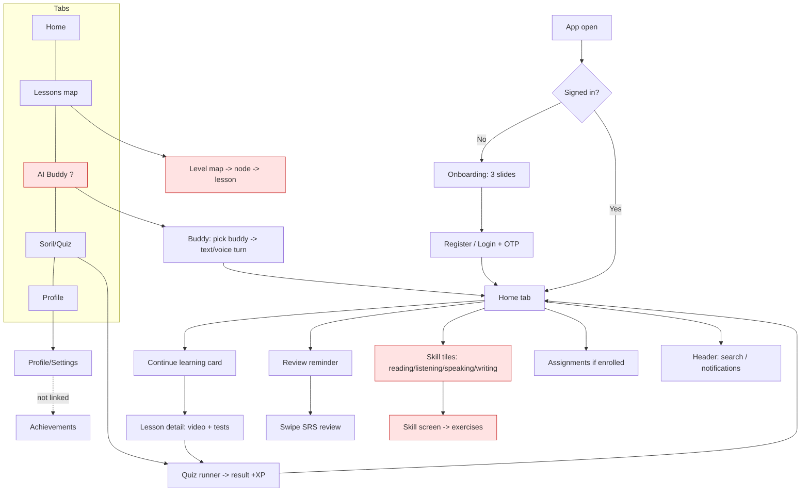
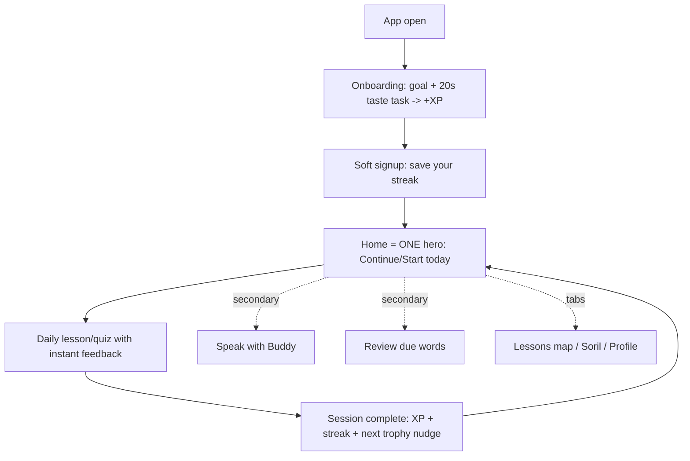

# SparkXP — Comprehensive UX Review

> **⏱ Статус шинэчлэл (2026-07-21, кодоос баталсан):** Delight давхарга, responsive,
> skeleton, tab bar шошго, chat, quiz баяр — **хийгдсэн**. Critical fixes (`UX_CRITICAL_SPEC.md`)
> төлөв: **C1** Home hero 🔶 хагас · **C2** quiz шууд-feedback 🔶 (баяр хийгдсэн,
> `/quizzes/:id/check` дутуу) · **C3** buddy scaffold 🔶 (таб шошго ✅, starter prompt дутуу)
> · **C4** taste-task онбординг ❌ эхлээгүй. Бүрэн launch төлөв → `ROADMAP.md §3`.

> **Reviewer lens:** Senior Product Designer · UX Strategist · Product Manager · UX Researcher.
> **Scope:** the SparkXP mobile app (Expo / React Native) — every primary screen,
> the end-to-end user journey, information architecture, feature priority, visual
> hierarchy, Nielsen heuristics, cognitive load, delight, and a prioritized roadmap.
> **Method:** grounded in the actual routes in `mobile/app/*` and components in
> `mobile/src/*`. This is an **analysis document** — no redesign, no code.
> **Companion:** `DESIGN_REVIEW.md` covers the *visual/motion/component* layer
> (haptics, animation, theming). This file covers the *product/UX/IA/flow* layer.

---

## 0. Executive Summary

SparkXP is a **gamified English-learning app for Mongolian students** (Duolingo-
inspired, purple "magical night-sky" brand, fox mascot). The foundation is strong:
a coherent brand, a real gamification spine (XP / streak / Sparks / trophies), a
broad content set (vocabulary, lessons, reading, quizzes, idioms), an AI speaking
buddy, and social/teacher features.

**The single biggest UX risk is not polish — it is _focus_.** The app tries to be
Duolingo + a dictionary + a reading app + a chatbot + a social/teacher platform at
once. A first-time student is dropped onto a **dense Home screen with ~6 competing
modules** and a **5-tab bar where the most differentiated feature (AI Buddy) is a
wordless center icon**. The result: the app's *core loop* ("learn a bit of English
every day and see progress") is present but **not obvious in the first 10 seconds**,
and the *primary next action* is ambiguous because 4–6 things compete for the tap.

| Dimension | Score /100 | One-line verdict |
| --- | --- | --- |
| Purpose clarity (first 10s) | 62 | Gamified learning is *felt* but not *stated*; Home is a menu, not a path |
| Core-loop obviousness | 58 | Too many entry points; no single "do this now" |
| Information architecture | 66 | 5 tabs are reasonable, but Home duplicates the tabs + hides depth |
| Navigation intuitiveness | 70 | Tabs OK; center AI-buddy icon + deep stack routes are guessy |
| Onboarding effectiveness | 60 | 3 slides exist; likely sells brand, not the "why/how" or a first win |
| Visual hierarchy | 72 | Beautiful, but everything is a card → weak "what matters most" |
| Cognitive load | 55 | Home + Quiz + Chat each ask a lot at once |
| Delight / premium feel | 74 | Strong brand + mascot; motion/feedback gaps (see DESIGN_REVIEW) |
| Consistency | 68 | Mixed patterns (map vs list vs grid; some raw text screens) |
| **Overall UX** | **65** | **A capable product one focus-pass away from feeling effortless** |

**Top 5 moves (detailed in the roadmap):**
1. **Give Home one hero "Continue / Start" action** and demote the rest — turn a
   menu into a path.
2. **Make the AI Buddy tab legible** (label + a clear "practice speaking" promise);
   it's the differentiator and it's currently a mystery icon.
3. **Deliver a first win in onboarding** (a 20-second lesson/quiz before signup or
   immediately after) so value is *experienced*, not *described*.
4. **Unify the "practice a skill" entry points** — Home skill tiles, Lessons map,
   and Soril overlap and confuse "where do I actually learn?".
5. **Add the missing states** (empty/error/skeleton) consistently, and real
   gamification data (streak/level/progress are partly placeholders).

---

## 1. Screen-by-Screen Analysis

> Screens are grouped by journey. For each: Purpose · User goal · Strengths ·
> Weaknesses/UX problems · Hierarchy · CTA · Navigation · Accessibility ·
> Missing states · Recommendations.

### 1.1 Onboarding — `app/(auth)/onboarding.tsx` (3 slides)
- **Purpose:** introduce the brand/value before auth.
- **User goal:** "Should I bother signing up? What will this do for me?"
- **Strengths:** on-brand, fox mascot, sets the purple identity.
- **UX problems:** 3 marketing slides typically **describe** the app instead of
  letting the user **feel a win**. For a learning app, the strongest onboarding is
  *do one tiny lesson, get +XP, then ask to save progress* (Duolingo's model). Pure
  slides → high drop-off at the signup wall.
- **Hierarchy/CTA:** likely "Next → Get started"; fine, but the CTA sells *signup*,
  not *learning*.
- **Missing states:** no "skip", no progress preview, no placement result.
- **Recommendations:**
  1. **Value-first, then a 20-second taste task** (pick a goal → answer 1–2 word
     questions → "+10 XP! Save your streak?" → signup). Move the auth wall *after*
     the first dopamine hit.
  2. **Ask 1 question that personalizes Home** ("Why are you learning?" / level),
     so Home isn't generic on first open.
  3. Keep it to **≤3 taps to first content**.

### 1.2 Auth — `login.tsx` / `register.tsx` / `forgot.tsx` + `SignInSheet.tsx`
- **Purpose:** account creation / return.
- **Strengths:** username-or-email login, OTP verify, password reset, inline error +
  shake feedback (per DESIGN_REVIEW).
- **UX problems:** auth **before any value** (see 1.1). Register asks for
  username+email+password up front = friction before the user is convinced.
- **Missing states:** confirm OTP resend cooldown is visible; loading on submit.
- **Recommendations:** allow **guest/"try first"** or social login; defer required
  fields; show why email is needed (verification/streak safety).

### 1.3 Home — `app/(tabs)/index.tsx` ⭐ (most important screen)
- **Purpose:** daily hub — resume learning, see progress, pick a skill.
- **User goal:** "What should I do right now?"
- **Strengths:** gorgeous fox-island hero; streak/gem/XP glanceable; "Continue
  learning" card is the *right* idea; live exercise counts; pull-to-refresh.
- **UX problems (the core issue):**
  - **~6 competing modules stacked** (Continue · Review reminder · Assignments ·
    "Today's tasks" 4 skill tiles · counts). No single dominant action → **decision
    fatigue on the highest-traffic screen**.
  - **Continue-progress is a placeholder (75%)** — erodes trust the moment a user
    notices it never changes.
  - **Skill tiles (reading/listening/speaking/writing)** duplicate what the Lessons
    tab and Soril tab also offer → "where do I actually learn?" ambiguity.
  - Streak/level are partly placeholder data (real data pending backend).
- **Hierarchy:** the hero (decoration) dominates the fold; the **most valuable
  element (Continue) sits below it** and competes with 3 sibling cards of equal
  weight. Eyes land on the fox first (nice) but then scatter.
- **CTA:** "Continue →" exists but is *one of many* equally-styled buttons.
- **Navigation:** tiles route to `/skill/<key>` and `/reading`; fine, but it's a
  second parallel nav to the tab bar.
- **Accessibility:** icon-only header buttons need labels (see DESIGN_REVIEW #18);
  4-across skill tiles at `width:23%` are tight touch targets.
- **Missing states:** **no skeleton** (values pop in from 0); no "brand-new user"
  state (empty streak/continue) vs "returning" state.
- **Recommendations:**
  1. **One hero action:** a single large "Continue / Start today's lesson" card at
     the top of the body (with real progress). Everything else becomes a smaller,
     scannable secondary row.
  2. **Collapse the parallel nav:** Home should *launch the daily path*, not
     re-list every skill the tabs already expose. Keep 1 "Practice a skill" entry,
     not 4 tiles + a tab + Soril.
  3. **Real data or hide it** (no fake 75%).
  4. **First-run Home** = a friendly "start here" with 1 obvious tap.

### 1.4 Lessons — `app/(tabs)/lessons.tsx` + `level/[code].tsx` (adventure map)
- **Purpose:** structured curriculum as a Duolingo-style island/node map.
- **User goal:** "Where am I, and what's the next lesson?"
- **Strengths:** the map metaphor is motivating and on-trend; CEFR tiers; node path.
- **UX problems:**
  - **Overlaps Home's "Continue" and the skill tiles** — three things claim "learn".
  - Map screens can hide **"what do I do next"** if the current node isn't visually
    unmistakable (needs a single pulsing "YOU ARE HERE / next" node).
  - Locked vs unlocked must be instantly readable (lock reveal exists per
    DESIGN_REVIEW #22).
- **Hierarchy/CTA:** the **next available node is the CTA** — it must be the loudest
  thing on screen.
- **Missing states:** empty (no lessons yet), fully-completed, loading map.
- **Recommendations:** make the **next node unmistakable + auto-scroll to it**;
  ensure Home "Continue" and this map point to the *same* next lesson (one source of
  truth), not two competing ideas.

### 1.5 AI Buddy (Chat) — `app/(tabs)/chat.tsx` ⭐ (the differentiator)
- **Purpose:** conversational English practice (text + voice) with a 3D fox tutor;
  ChatGPT-style multi-thread history.
- **User goal:** "Talk/type in English and get gently corrected."
- **Strengths:** genuinely differentiating (most learning apps lack live speaking);
  buddy picker, 3D avatar, correction + follow-up, thread history — this is a
  flagship, premium feature.
- **UX problems:**
  - **The tab is a wordless center fox icon** — new users don't know it's "practice
    speaking with AI". The app's strongest feature is its least legible entry point.
  - **Voice needs setup + limits** (mic permission, monthly voice minutes, ElevenLabs
    credits). If a user's first tap hits a limit/permission wall, the wow-moment dies.
  - **Blank-canvas problem:** "type or talk" with no scaffolding intimidates
    beginners. Needs **suggested first prompts / topics** ("Order coffee", "Talk about
    your day").
  - Correction UI + emotion/avatar are rich → risk of **information overload** in one
    bubble (reply + correction + follow-up + XP + avatar).
- **Hierarchy/CTA:** the mic/send is the CTA; make "press to speak" the obvious hero
  in an immersive layout (see the earlier "3D buddy call" recommendation).
- **Missing states:** first-time (no messages) needs a warm starter; voice-limit →
  graceful fall to text with a clear message; offline fallback.
- **Recommendations:**
  1. **Label the tab** ("Buddy" / "Speak") and add a one-line promise on first open.
  2. **Scaffold the first turn** with tappable starter prompts + a visible "voice
     minutes left" meter.
  3. **Progressive disclosure** of correction detail (show reply first; tap to expand
     the grammar note) to cut per-turn load.

### 1.6 Soril / Quiz — `app/(tabs)/soril.tsx`, `quiz/[id].tsx`, `game/[mode].tsx`
- **Purpose:** test/practice via quizzes (MCQ, fill-blank, word-match) → XP.
- **User goal:** "Check what I know / earn XP fast."
- **Strengths:** multiple question types; XP reward; result screen with breakdown.
- **UX problems:**
  - **No per-answer feedback** — the user only learns right/wrong at the end (see
    DESIGN_REVIEW #5). This breaks the core learning dopamine loop that Duolingo
    nails; it makes quizzes feel like *testing*, not *learning*.
  - **Overlaps Home skill tiles + Lessons tests** — "quiz" appears in ≥3 places.
  - Result screen: static 🎉 emoji, no celebration → the reward feels flat.
- **Hierarchy/CTA:** "Submit/Next" is clear; good.
- **Missing states:** empty (no quizzes for a skill), retry on error (exists),
  loading skeleton (exists for quiz).
- **Recommendations:** **instant right/wrong feedback per question** (green/red +
  correct answer + haptic) is the single highest-impact UX fix in the app; add a
  real result celebration; clarify Soril's role vs lesson tests.

### 1.7 Reading — `reading/index.tsx`, `reading/[id].tsx`
- **Purpose:** graded reading passages with tap-to-translate.
- **User goal:** "Read something at my level and understand new words."
- **Strengths:** **tap-to-translate (double-tap word → meaning + audio + save)** is
  an excellent, sticky micro-interaction; category browsing; finish → +XP.
- **UX problems:** discoverability of tap-to-translate (users won't know to
  double-tap without a one-time coach mark); reading progress visibility.
- **Missing states:** empty category, long-passage loading, "no translation found".
- **Recommendations:** **one-time hint** ("double-tap any word"); scroll-linked
  progress; surface Reading more prominently (it's a strong, calm counter-balance to
  quizzes but is buried under a Home tile).

### 1.8 Review / Swipe (SRS) — `app/swipe.tsx`, `saved.tsx`, `reviews`
- **Purpose:** spaced-repetition review of saved words (SM-2).
- **User goal:** "Reinforce words I'm forgetting."
- **Strengths:** SRS is pedagogically the *right* retention engine; "words due"
  count on Home is a good nudge.
- **UX problems:** SRS is powerful but **invisible/under-explained** — users don't
  know *why* reviewing matters or that the count is personalized. It's a Home card,
  not a first-class habit.
- **Missing states:** nothing-due (celebrate), first-time (explain SRS simply).
- **Recommendations:** frame it as a **daily "warm-up"** with a clear payoff; explain
  in one friendly line the first time.

### 1.9 Profile — `app/(tabs)/profile.tsx`, `settings.tsx`, `avatar.tsx`
- **Purpose:** identity, stats, level, settings, appearance toggle.
- **User goal:** "See my progress & manage my account."
- **Strengths:** premium palette, light/dark toggle, level ring, stat cards.
- **UX problems:** profile often becomes a **junk drawer** (stats + settings + avatar
  + assignments + logout). Risk of burying key progress under settings.
- **Missing states:** stat count-up (nice-to-have), empty achievements link.
- **Recommendations:** split **"Me / Progress"** (trophies, streak calendar, level)
  from **"Settings"**; make the **Achievements/trophies** screen reachable from here
  (it exists — `/achievements` — but isn't linked).

### 1.10 Achievements / Trophies — `app/achievements.tsx` (new)
- **Purpose:** show the 100-trophy catalog (earned vs locked) across 10 tiers.
- **User goal:** "What have I earned / what's next to chase?"
- **Strengths:** strong collection/progress motivator; tiered rarity; R2-optimized
  thumbnails.
- **UX problems:** **not linked from anywhere in the UI yet** (dead feature until
  Profile/Home links it); "earned 0/100" on a brand-new account can feel discouraging
  without a "next to unlock" nudge.
- **Missing states:** all-locked new user needs a "closest 3 to earn" section.
- **Recommendations:** link from Profile; surface **"next trophy" progress** on Home
  or after a session (a huge retention lever — collection loops).

### 1.11 Leaderboard — `app/leaderboard.tsx`
- **Purpose:** social ranking by XP (weekly/monthly/all-time; global/class/etc.).
- **User goal:** "How do I compare?"
- **Strengths:** periods + scopes; class scope ties to teacher feature; XP-based
  (correct — not spendable Sparks).
- **UX problems:** for solo/new users leaderboards can **demotivate** (bottom of a
  global list). Class/friends scope is the motivating one and should default when
  available.
- **Missing states:** empty (no class), you're-#1, not-ranked-yet.
- **Recommendations:** **default to the most personal scope** (class/friends); show
  "you vs people near you," not just the global top.

### 1.12 Teacher section — `app/(teacher)/*`, `join/*`, `invite/*`
- **Purpose:** classes, join codes/QR, approvals, assign lessons/quizzes, class
  leaderboard.
- **User goal (teacher):** "Set up a class and assign work." **(student):** "Join my
  class."
- **Strengths:** real B2B2C value (schools/orgs); QR + code join; approval gate.
- **UX problems:** **role-based UI divergence** adds complexity; students may see
  assignment concepts before joining a class → confusing empty states.
- **Missing states:** student with no class (Home "assignments" card should hide —
  it does), teacher with no class yet (guided setup).
- **Recommendations:** keep the **teacher flow entirely separate** from the student
  core; guided "create your first class" wizard.

### 1.13 Idioms — `idioms/index.tsx`, `idiom/[id].tsx`
- **Purpose:** browse idioms (list + detail, image + audio).
- **Classification:** **secondary content** — nice, but competes for attention with
  core loops. Fine as a browse-able library; should not sit at the same priority as
  Lessons/Review.

### 1.14 Notifications — `app/notifications.tsx`
- **Purpose:** in-app notifications (streak/assignments/content).
- **UX problems:** Expo push not wired yet (per backend) → the bell may feel inert.
- **Recommendations:** wire streak/assignment pushes (retention); ensure the unread
  dot reflects reality.

---

## 2. User Flow Analysis

### Current flow (as-is)

**Flow findings:**
- ✅ **First impression** (brand/mascot) is strong.
- ❌ **Value-in-5-seconds:** weak — Home is a menu; no single "do this."
- ❌ **Path to core feature is forked:** "learn a skill" is reachable via Home tiles
  *and* Lessons tab *and* Soril — three doors to overlapping rooms (red nodes).
- ❌ **Differentiator hidden:** AI Buddy is a wordless center icon.
- ⚠️ **Dead ends / dangling:** Achievements exists but is unlinked; notifications bell
  may be inert.
- ⚠️ **Auth wall before value:** users must commit before experiencing a win.

### Target flow (recommended shape)

The target collapses 3 overlapping "learn" doors into **one daily path**, moves the
first win *before* the auth wall, and demotes everything else to clearly secondary.

---

## 3. Information Architecture

**Current tabs:** Home · Lessons · **AI Buddy (center)** · Soril · Profile.

| IA question | Verdict | Note |
| --- | --- | --- |
| Features grouped logically? | ⚠️ Partly | "Learning" is split across Home tiles, Lessons, Soril |
| Nav structure sensible? | ✅ 5 tabs is right | But center tab is unlabeled + ambiguous |
| Labels understandable? | ⚠️ | "Soril" vs "Lessons" vs skill tiles overlap; AI tab has no label |
| Naming consistent? | ⚠️ | Skill names (Сонсгол/Унших/Нөхөх/Бичих) vs tab names vs quiz categories |
| Important features easy to find? | ⚠️ | Reading, Review/SRS, Achievements are buried |
| Less-important features distract? | ❌ | Idioms, some Home cards compete with core loop |

**IA problems:**
1. **Two parallel navigations** — the tab bar *and* Home's module grid both route to
   overlapping destinations. Pick one primary nav; make Home a *launcher*, not a
   duplicate menu.
2. **The 5th "meaning" is unclear** — is the daily habit *Lessons*, *Soril*, or *Home
   tiles*? Users must build a mental model the app doesn't hand them.
3. **Hidden depth** — Reading, SRS Review, Achievements, Idioms live one level down
   with weak signposting.

**Recommended IA (conceptual):**

| Tab | Owns | Rationale |
| --- | --- | --- |
| **Learn** (Home) | Today's path: Continue → lesson/quiz → review; 1 hero CTA | The daily loop; everything else is secondary |
| **Practice** | Speak (Buddy) + Reading + Review/SRS, grouped as "ways to practice" | Consolidate scattered practice modes under one clear label |
| **Compete** | Leaderboard + Achievements/trophies | Social + collection motivators together |
| **Profile** | Me/progress + settings | Identity + config |

(4 tabs; AI Buddy gets a *labeled* prominent slot inside "Practice" or as its own
labeled tab — but never a wordless icon.)

---

## 4. Feature Prioritization

| Feature | Class | Currently prioritized as | Aligned? |
| --- | --- | --- | --- |
| Daily lesson / continue learning | **Core** | 1 of 6 Home cards | ❌ under-weighted |
| Quiz / Soril (with feedback) | **Core** | Tab (good) but no per-answer feedback | ⚠️ |
| AI speaking Buddy | **Core differentiator** | Unlabeled center icon | ❌ hidden |
| Vocabulary + SRS review | **Primary** | Home card / buried tab | ❌ under-weighted |
| Reading (tap-to-translate) | **Primary** | Home tile / buried | ⚠️ |
| Streak / XP / trophies (gamification) | **Primary** | Visible (good) but partly placeholder | ⚠️ |
| Leaderboard | **Supporting** | Buried route | ⚠️ (fine to be supporting) |
| Teacher / classes | **Supporting (B2B)** | Separate section | ✅ |
| Idioms | **Secondary** | Buried | ✅ |
| Notifications | **Supporting** | Bell (inert) | ⚠️ |
| Avatar / cosmetics | **Rarely used** | Profile | ✅ |

**Key mismatch:** the **three core things** (daily lesson, quiz-with-feedback, AI
speaking) are respectively *under-weighted*, *missing feedback*, and *hidden* — while
**decorative/duplicate modules** get equal Home real estate. The UI does not yet
express the business priority (retention via a daily learning + speaking loop).

---

## 5. Visual Hierarchy

- **Typography:** intent-based scale exists (`theme.ts` display/h1/h2/body/…) — good
  foundation. But screens over-use `h3` card titles at equal weight → **everything
  reads as equally important**.
- **Spacing:** consistent 4pt scale; Home is dense (6 modules) with little
  "breathing room" to signal priority.
- **Color:** strong purple identity; gold XP / blue gem / orange streak accents read
  well. Risk: many colored chips at once dilute emphasis.
- **Component emphasis:** **card-on-card uniformity** is the main issue — Continue,
  Review, Assignments, and skill tiles are all similarly-weighted cards, so the eye
  has **no clear #1**.
- **CTA visibility:** primary buttons exist but are flat (per DESIGN_REVIEW — the
  glow gradient is defined yet unused), so the main CTA doesn't "pop" above secondary
  ones.
- **Scanability:** the fox-island hero is beautiful but occupies the fold; the *most
  valuable* element (Continue) is pushed below and competes with siblings.

**Where the eye goes first (Home):** the **fox-island illustration** (decoration),
then it **scatters across 4 equal cards**. It *should* land on **one hero "Continue/
Start" action**. Today, decoration wins and action diffuses.

---

## 6. Nielsen Heuristic Evaluation

| # | Heuristic | Score /10 | Key finding | Recommendation |
| --- | --- | --- | --- | --- |
| 1 | Visibility of system status | 6 | Streak/XP visible, but progress is placeholder; missing skeletons; quiz gives no per-answer status | Real progress; skeletons; instant answer feedback |
| 2 | Match to real world | 8 | Mongolian-first, familiar gamified metaphors, fox mascot | Keep; ensure skill labels map to plain concepts |
| 3 | User control & freedom | 6 | Auth wall early; limited "back out"; can't easily skip onboarding | Add skip/guest; clear back everywhere |
| 4 | Consistency & standards | 6 | Map vs list vs grid patterns; some raw-text screens; overlapping "learn" doors | Unify patterns + one learn path |
| 5 | Error prevention | 6 | Voice limits/permissions can hit as errors mid-flow; quiz can't undo an answer pre-submit? | Pre-check limits; confirm/allow answer change |
| 6 | Recognition over recall | 7 | Icon-based tabs (good) but AI tab is unlabeled → recall required | Label all tabs; coach marks for hidden gestures |
| 7 | Flexibility & efficiency | 6 | Power users lack shortcuts; too many taps to core action | 1-tap "continue"; recent/quick actions |
| 8 | Aesthetic & minimalist design | 6 | Beautiful but **Home is maximalist** (6 modules) | Reduce Home to 1 hero + secondary row |
| 9 | Help users with errors | 6 | Some retry states exist; voice/AI failure messaging unclear | Friendly, actionable error copy + fallback |
| 10 | Help & documentation | 5 | Little in-context help; hidden gestures (double-tap translate) undocumented | One-time coach marks; empty-state guidance |
| — | **Average** | **6.2** | Solid product, thin on *guidance, status, and focus* | — |

---

## 7. Cognitive Load Analysis

| Overload source | Where | Fix |
| --- | --- | --- |
| **Too many equal choices** | Home (6 modules) | 1 hero + collapse duplicates |
| **Parallel navigation** | Home tiles vs tabs | Home = launcher, not menu |
| **Dense per-turn info** | AI Buddy (reply + correction + follow-up + XP + avatar) | Progressive disclosure (tap to expand grammar) |
| **Overlapping "learn" doors** | Home tiles / Lessons / Soril | One daily path; distinct roles |
| **Deferred feedback** | Quiz (results only at end) | Instant per-answer feedback (less end-load) |
| **Hidden gestures** | Reading double-tap | One-time coach mark |
| **Placeholder data** | Home progress/streak | Real data or hide |

**Net:** the app asks the user to *build the mental model itself*. Reducing Home to a
single obvious action and consolidating the "learn/practice" doors would cut load
more than any visual tweak.

---

## 8. Delight & Product Experience

| Attribute | Rating | Note |
| --- | --- | --- |
| Modern | ✅ Strong | Purple night-sky, 3D icons, glassy touches |
| Premium | 🟡 Mixed | Great brand; flat CTAs + motion/feedback gaps (see DESIGN_REVIEW) |
| Friendly | ✅ Strong | Fox mascot, warm palette, Mongolian-first |
| Playful | ✅ | Map, mascot, gamification |
| Trustworthy | 🟡 | Placeholder data (fake 75%) undermines trust when noticed |
| Fast | 🟡 | No skeletons → "pop-in"; perceived-speed opportunity |
| Smooth | 🟡 | Motion/haptics underused (per DESIGN_REVIEW) |
| Delightful | 🟡 | Missing celebration (quiz result), reward feedback, coach marks |
| Consistent | 🟡 | Mixed screen patterns |

**Highest-leverage delight moves:** (1) real celebration on quiz/lesson complete +
streak; (2) a "+XP" toast + haptic on every reward; (3) the fox reacting (idle/
celebrate) as an emotional through-line; (4) skeletons for perceived speed. (These
are detailed in `DESIGN_REVIEW.md`.)

---

## 9. Benchmark Comparison (UX patterns, not visuals)

| App | Pattern SparkXP should borrow |
| --- | --- |
| **Duolingo** | *One* obvious "next lesson" per screen; **instant per-answer feedback**; taste-task before signup; streak as the emotional core; character reactions |
| **Apple (Fitness/Health)** | Rings/one-glance daily goal; calm hierarchy — one hero metric, everything else secondary |
| **Spotify** | Home as a *personalized launcher* to one obvious next action (not a flat menu) |
| **Notion / Linear** | Ruthless IA: few top-level areas, deep but discoverable; consistent patterns |
| **Airbnb** | Progressive disclosure; strong empty/loading states; trust cues |
| **Stripe** | Clarity of purpose in seconds; excellent status/feedback on every action |
| **Google** | Recognition-over-recall labeling; accessible touch targets + labels |

**Gap vs best-in-class:** SparkXP has Duolingo's *ingredients* (gamification, content,
mascot) but not yet Duolingo's *discipline* — **one path, instant feedback, value
before signup, and a single obvious next tap.**

---

## 10. Prioritized Improvement Roadmap

> Each item: **Problem · Why it matters · Solution · Expected impact.**

### 🟥 Critical (must fix — highest impact on activation & retention)

**C1. Home has no single primary action.**
- *Why:* the highest-traffic screen forces a choice among 6 modules → decision
  fatigue, weak daily habit.
- *Solution:* one large "Continue / Start today" hero (real progress) at top;
  everything else becomes a compact secondary row.
- *Impact:* ↑ daily-active retention, ↑ session start rate; the single biggest lever.

**C2. Quiz gives no per-answer feedback.**
- *Why:* removes the core learning dopamine loop; quizzes feel like exams, not
  learning (Duolingo's #1 pattern).
- *Solution:* instant right/wrong + correct answer + haptic per question; celebrate at
  the end.
- *Impact:* ↑ completion, ↑ learning efficacy, ↑ "fun/again" rate.

**C3. The AI Buddy (differentiator) is a wordless, walled entry point.**
- *Why:* your most unique value is the least legible; first tap may hit a
  permission/limit wall.
- *Solution:* label the tab; add a one-line promise + tappable starter prompts;
  show voice-minutes; pre-check limits and fall back to text gracefully.
- *Impact:* ↑ feature discovery + activation of the flagship; stronger differentiation.

**C4. Value comes after the auth wall.**
- *Why:* users commit (username+email+password+OTP) before feeling a win → drop-off.
- *Solution:* onboarding taste-task (+XP) before soft signup; allow guest/social.
- *Impact:* ↑ signup conversion, ↓ first-run abandonment.

### 🟧 High priority

**H1. Collapse the three overlapping "learn" doors** (Home tiles / Lessons / Soril)
into distinct roles + one daily path. *Impact:* ↓ cognitive load, clearer mental model.

**H2. Replace placeholder gamification data** (fake 75% progress, placeholder streak/
level) with real backend data — or hide until available. *Impact:* trust, credibility.

**H3. Add consistent missing states** — skeletons (perceived speed), empty states
(new user, no class, nothing-due), friendly errors. *Impact:* polish, perceived speed,
fewer dead-ends.

**H4. Link + surface Achievements/Trophies** (from Profile + a "next trophy" nudge
post-session). *Impact:* activates a strong collection/retention loop that's currently
dead.

**H5. Reveal hidden gestures/features** (Reading double-tap coach mark; make Reading
and SRS Review first-class, not buried). *Impact:* discovery of sticky features.

### 🟨 Medium priority

**M1. Consolidate IA to ~4 clear tabs** (Learn / Practice / Compete / Profile) with a
*labeled* Buddy slot. *Impact:* long-term clarity.

**M2. Default Leaderboard to the most personal scope** (class/friends), show "near
you," not just global top. *Impact:* motivation, less demotivation for new users.

**M3. Progressive disclosure in AI Buddy** (reply first, expand grammar on tap).
*Impact:* ↓ per-turn overload.

**M4. Personalize Home from an onboarding question** (goal/level). *Impact:* relevance
on first open.

### 🟩 Low priority / nice-to-have

- **L1.** Fox mascot emotional through-line (idle/celebrate reactions).
- **L2.** Quick actions / shortcuts for power users (jump to review, resume last).
- **L3.** Streak calendar + "freeze" mechanics (retention polish).
- **L4.** In-context help / tips system.
- **L5.** Wire push notifications (streak/assignment nudges) once Expo push lands.

---

## 11. One-Paragraph Verdict

SparkXP is a **well-branded, feature-rich learning app that is one focus-pass away
from feeling effortless.** It already has the hard parts — a gamification spine, broad
content, a genuinely differentiating AI speaking buddy, and a lovable mascot. What it
lacks is **product discipline in the moments that matter most**: a Home that *directs*
instead of *lists*, a quiz loop that *teaches in real time*, a differentiator that
*announces itself*, and a first run that *delivers a win before asking for commitment*.
Fix those four (Critical) items and the perceived quality, activation, and retention
will jump far more than any purely visual redesign. **Analyze first, then redesign
around a single, obvious daily path.**
